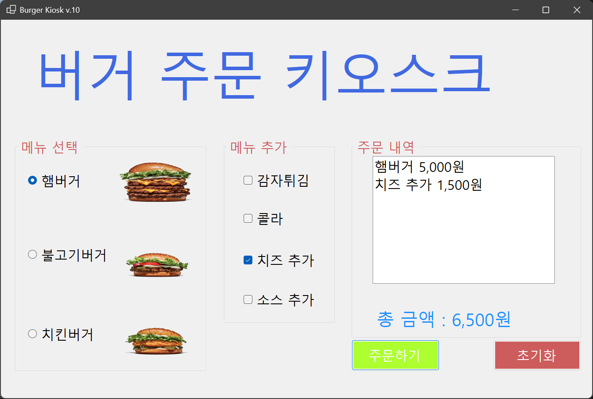

# (C# 코딩) 버거 주문 키오스크

## 개요
- C# 프로그래밍 학습
- 1줄 소개: 사용자가 햄버거 메뉴와 추가 옵션을 선택하고 총 금액을 계산하는 주문 프로그램
- 사용한 플랫폼: C#, .NET Windows Forms, Visual Studio, GitHub
- 사용한 컨트롤: Label, RadioButton, CheckBox, ListBox, Button, PictureBox, GroupBox
- 사용한 기술과 구현한 기능:
  - Visual Studio를 이용하여 키오스크 UI 디자인
  - RadioButton과 CheckBox의 Checked 속성을 활용한 조건 분기 및 가격 합산 로직 구현
  - ToString() 메서드를 활용한 문자열 포맷팅 및 결과 UI 출력

## 실행 화면

### 과제 1: 기본 UI 배치 및 기능 구현

**구현한 내용(위 그림 참조)**
- UI 구성 : GroupBox를 사용해 화면을 의미별로 시각적 그룹화.
- 컨트롤 배치 : 라디오버튼 3개(메뉴), 체크박스 4개(옵션), 리스트박스(영수증), 버튼 2개 등 배치.
- 기능 1 : 사용자가 항목을 선택하고 '주문하기' 클릭 시 총 금액과 내역 표시.
- 기능 2 : '초기화' 버튼 클릭 시 선택 내역이 초기화되고 총 금액이 0원으로 재설정됨.

## 배운 내용
- (여기에 이번 과제를 하면서 느낀 점이나 어려웠던 점, 새롭게 알게 된 점을 1~2줄 자유롭게 적어주세요!)