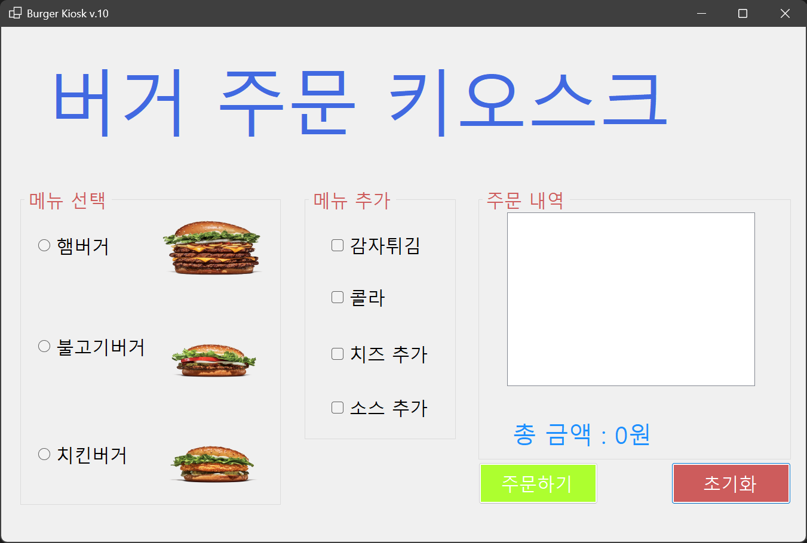
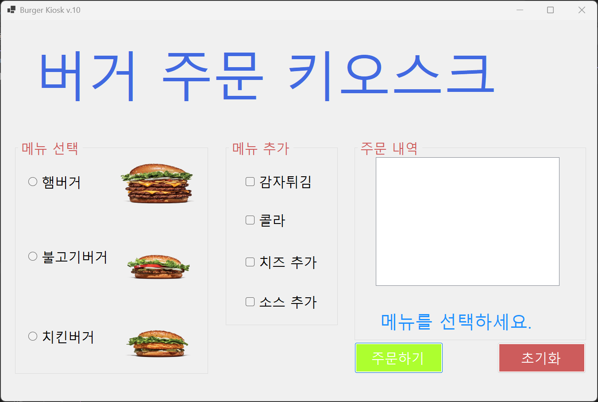
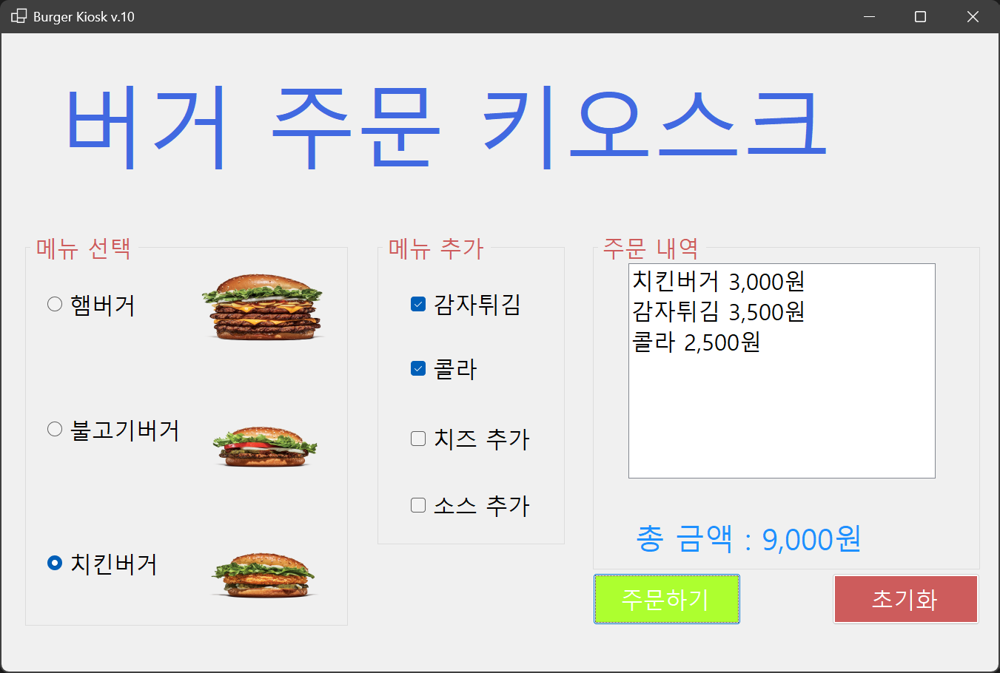

# (C# 코딩) 버거 주문 키오스크

## 개요
- C# 프로그래밍 학습
- 1줄 소개: 사용자가 햄버거 메뉴와 추가 옵션을 선택하고 총 금액을 계산하는 주문 프로그램
- 사용한 플랫폼: C#, .NET Windows Forms, Visual Studio, GitHub
- 사용한 컨트롤: Label, RadioButton, CheckBox, ListBox, Button, PictureBox, GroupBox
- 사용한 기술과 구현한 기능:
  - Visual Studio를 이용하여 키오스크 UI 디자인
  - RadioButton과 CheckBox의 Checked 속성을 활용한 조건 분기 및 가격 합산 로직 구현
  - ToString() 메서드를 활용한 문자열 포맷팅 및 결과 UI 출력

## 실행 화면

### 과제 1: 기본 UI 배치 및 기능 구현

**구현한 내용(위 그림 참조)**
- UI 구성 : GroupBox를 사용해 화면을 의미별로 시각적 그룹화.
- 컨트롤 배치 : 라디오버튼 3개(메뉴), 체크박스 4개(옵션), 리스트박스(영수증), 버튼 2개 등 배치.
- 기능 1 : 사용자가 항목을 선택하고 '주문하기' 클릭 시 총 금액과 내역 표시.
- 기능 2 : '초기화' 버튼 클릭 시 선택 내역이 초기화되고 총 금액이 0원으로 재설정됨.

### 과제 2: 에러 메시지 화면 표시

**구현한 내용(위 그림 참조)**
- 예외 처리 : 아무 메뉴도 선택하지 않고 주문하기 버튼을 누를 경우의 조건문 추가
- UI 반영 : 팝업창(MessageBox) 대신 Label을 사용하여 사용자 흐름이 끊기지 않도록 에러 메시지 표시 

### 과제 3: 키보드 사용 주문 (UX 개선)

**구현한 내용**
- **탭 순서 최적화**: TabIndex 속성을 조정하여 사용자가 Tab 키로 메뉴, 옵션, 버튼 사이를 자연스럽게 이동하도록 설정함.
- **Enter 키 주문**: 별도의 클릭 없이 엔터 키만으로 주문이 완료되도록 Form의 AcceptButton을 '주문하기' 버튼과 연결함.
- **접근성 향상**: 조작이 필요 없는 주문 내역(ListBox)은 Tab 포커스가 가지 않도록 TabStop을 비활성화하여 이동 단계를 단축함.
- **포커스 제어**: 초기화 버튼 클릭 시 포커스를 첫 번째 메뉴로 강제 이동시켜 키보드 조작 흐름이 끊기지 않도록 처리함.

### 과제 4: 선택 즉시 표시정보 갱신

**구현한 내용**
- **실시간 데이터 바인딩**: 모든 입력 컨트롤의 상태 변화(CheckedChanged)를 감지하여 실시간으로 영수증 내역과 합계 금액을 업데이트함.
- **사용자 경험(UX) 고도화**: 프로그램 시작 시 특정 항목이 미리 선택/강조되어 보이는 현상을 방지하기 위해 초기 포커스를 조정함.
- **코드 효율성**: 공통 함수(`UpdateOrder`)를 재사용하여 이벤트 발생 시마다 정확한 계산 로직이 수행되도록 구현함.